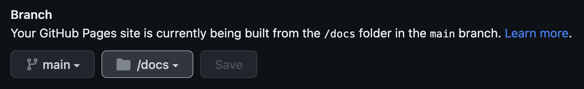

# Heisse Preise

A terrible grocery price search "app". Fetches data from big Austrian grocery chains daily and lets you search them. See <https://heisse-preise.io>.

The project consists of a trivial NodeJS Express server responsible for fetching the product data, massaging it, and serving it to the front end (see `server.js`). The front end is a least-effort vanilla HTML/JS search form (see sources in `site/`).

Contents:

-   [Requirements](#requirements)
-   [Running](#running)
    -   [Development](#development)
    -   [Production](#production)
    -   [Configuration](#configuration)
    -   [Via GitHub pages \& GitHub workflows](#via-github-pages--github-workflows)
    -   [Docker](#docker)
-   [Raw Data](#raw-data)
-   [Historical Data](#historical-data)

## Requirements

-   Node.js

## Running

### Development

Install NodeJS, then run this in a shell of your choice.

```bash
git clone https://github.com/badlogic/heissepreise
cd heissepreise
npm install
npm run dev
```

The first time you run this, the data needs to be fetched from the stores. You should see log out put like this.

```bash
Fetching data for date: 2023-05-23
Fetched LIDL data, took 0.77065160000324 seconds
Fetched MPREIS data, took 13.822936070203781 seconds
Fetched SPAR data, took 17.865891209602356 seconds
Fetched BILLA data, took 52.95784649944306 seconds
Fetched HOFER data, took 64.83968291568756 seconds
Fetched DM data, took 438.77065160000324 seconds
Merged price history
App listening on port 3000
```

Once the app is listening per default on port 3000, open <http://localhost:3000> in your browser.

Subsequent starts will fetch the data asynchronously, so you can start working immediately.

### Production

Install the dependencies as per above, then simply run:

```
npm run start
```

### Frontend

To build the `site/style.css` file, make sure to run `npm run build`. This will create a css file based on the tailwind styles used. You can continue to write normal CSS in the `site/tailwind.css` if you want.

### Configuration

You can pass the following options to the `server.js` script:

-   `-p`, `--port`: the port to listen on, defaults to the `PORT` environment variable, if set, or `3000`
-   `-l`, `--live-reload`: whether to enable live reload, defaults to `true` when `NODE_ENV` is `development`. Cannot be used in production.

### Via GitHub pages & GitHub workflows

Create a GitHub account and pick a username. Below, we assume your user name is `hotprices123`. **Replace `hotprices123` with your real username everywhere you see it below**

1. Log in to your GitHub account.
2. [Fork](https://github.com/badlogic/heissepreise/fork) this repository and name the repository `hotprices123.github.io`.
3. **In your forked repository**:
    1. go to `Settings > Pages`, then under `Branch` select the `main` branch, and the `docs/` directory as shown in this screenshot.
       
    2. go to `Settings > Actions > General`, then under `Workflow permissions`, select `Read and write permissions` as shown in this screenshot.
       
    3. go to the `Actions` tab, then select the `Pages Update` workflow in the list to the left, then click `Enable workflow`. Confirm that you know what you are doing.
       
4. Trigger the workflow once manually to build the initial site and data.
   
5. Once the workflow has finished, go to `https:/hotprices123.github.io` and enjoy your price comparisons.

The data will be automatically fetched once a day at 8am (no idea what timezone), and the site will be updated.

To get the latest code changes from this repository into your fork:

1. Go to `https://github.com/hotprices123/hotprices123.github.io/compare/main...badlogic:heissepreise:main`
2. Click on `Create pull request`
   
3. Enter a Title like "Updated from upstream", then click `Create pull request``
   
4. Click `Merge pull request`
   

Your site will now use the latest source code changes from this repository. It will be automatically updated and is usually live under `https://hotprices123.github.io` within 10-15 minutes.

### Docker

The project has a somewhat peculiar Docker Compose setup in `docker/` tailored to my infrastructure. You can entirely ignore it.

## Raw Data

You can also get the [raw data](https://heisse-preise.io/data/latest-canonical.json). The raw data is returned as a JSON array of items. An item has the following fields:

-   `store`: (`billa`, `spar`, `hofer`, `dm`, `lidl`, `mpreis`)
-   `name`: the product name.
-   `price`: the current price in €.
-   `priceHistory`: an array of `{ date: "yyyy-mm-dd", price: number }` objects, sorted in descending order of date.
-   `unit`: unit the product is sold at. May be undefined.
-   `quantity`: quantity the product is sold at for the given price
-   `bio`: whether this product is classified as organic/"Bio"

## Historical Data

The live site at [heisse-preise.io](https://heisse-preise.io) feature historical data from:

-   [Dossier](https://www.dossier.at/dossiers/supermaerkte/quellen/anatomie-eines-supermarkts-die-methodik/)
-   [@h43z](https://h.43z.one), who runs [preisinflation.online](https://inflation.43z.one), another grocery price tracker.
